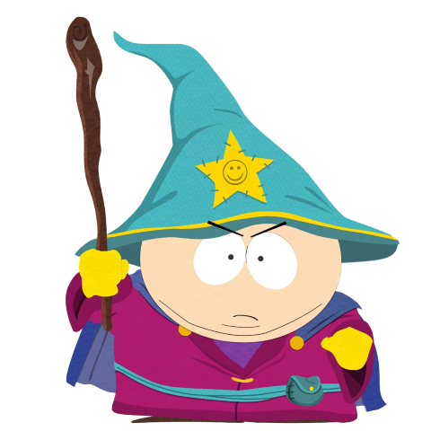

# Lesson2

## Text

Чтоб поставить заголовок 1го уровня 
Набираем 
(# Заголовок 1го уровня #)
обращаем внимание, что строка 3 в предпросмотре отражается на строке 2

(# H1 заголовок 1го уровня)
(## H2 заголовок 2го уровня)
(### H3 Заголовок 3го уровня)
(#### H4 Заголовок 4 уровня)
(##### H5 заголовок 5го уровня)
(###### H6 заголовок 6го уровня)

Курсив обозначается *звездочками* или _подчеркиванием_

Полужирный шрифт - двойными  **звездочками** или __подчеркиванием__.

Комбинированное выделение **звездочками и _подчеркиванием_**.

Для зачеркнутого текста используются две тильды . ~~Уберите это~~

## List (Список)

1. первый
2. второй
3. третий

или же можно  ненумерованный список через (*)

* первый
* второй
* третий

## Pictures

## URL
https://google.com

## Tabs
| Fun                  | With                 | Tables          |
| :------------------- | -------------------: |:---------------:|
| left-aligned column  | right-aligned column | centered column |
| $100                 | $100                 | $100            |
| $10                  | $10                  | $10             |
| $1                   | $1                   | $1              |

## Quote (Цитаты)

>цитата первого уровня
>>цитата второго уровня
>>> Цитата третьего уровня

## Тут будет информация по игнору

## Раздел для FAQ

## просто по фану